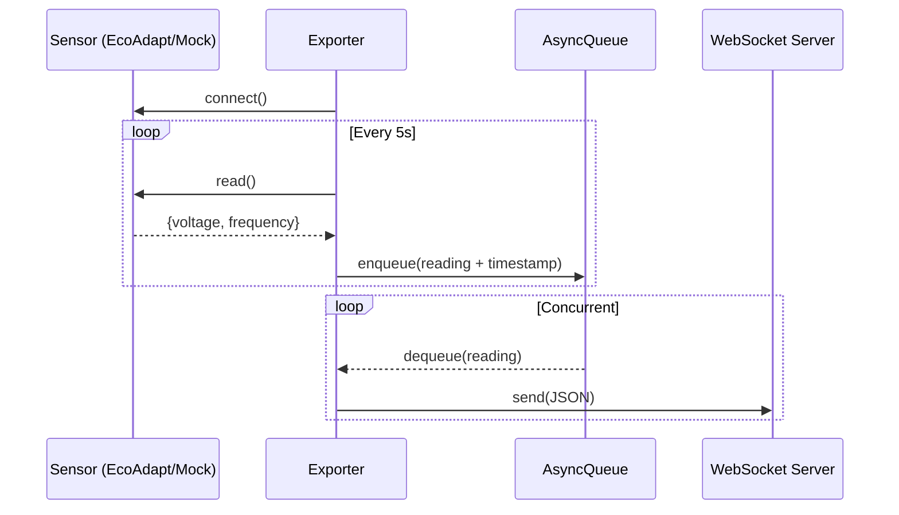

# Assignment: Exporter-Ecoadapt

In order to provide more accurate energy measurements for some of our customers, Sensorfact is investigating the addition of new 3rd-party sensors to its portfolio. We have found the [Eco-Adapt Power Elec 3 or 6](https://www.eco-adapt.com/products/) which meets our requirements. There is only one catch: its data can only be read via ModBus (an industrial fieldbus protocol), and we have no solution for that yet. For this assignment, you'll have to make a proof of concept to show that the Sensorfact bridges (Raspberry Pi based) can read data from the EcoAdapt sensor and send it to our backend. The proof of concept will also be used to estimate the complexity of building a production-proof solution.

## Requirements

To get a feel for the usability of the device, we need to read a value from the sensor and transfer it to the cloud. In this assignment you need to make code that:

- Reads the voltage and frequency from the sensor (it should be around 230V / 50Hz)
- Sends these values to a server periodically.

# Implemented Solution

My idea was to create a rough 3-layered sensor-to-cloud architecture. Where we first get the data from the sensor, then proces and package it in the bridge, then we send the data to the cloud.

For that I wanted to focus on creating an abstract HAL-like sensor gateway layer. Using a factory to create the idea of sensor abstraction, and separate simulation from ¨real" sensors. Then process and package the data in json format in the data bridge. And finally, the buffered data would be asyncronisly sent to the cloud using the websocket server.

## Assumptions taken
- Polling every 5 seconds
- Only phase 1 registers where considered (voltage and frequency)
- Register word order is swapped (derived from one sample output)

## Architecture: very high level overview

## Future ideas?
I did not manage to do everithing I wanted, since I had time constraint I did not attept to do TDD at all.

- Add tests
- I wanted things to be more concurrent and async. So I would create a data_entry or sensor_reading class, where each time the sensors are read, there would be a new data instance. Then maybe we can stack them based on priority, fir the bridge to process them acordinglly?... something with lambda functions to make it really async. I don't know if its worth it, but it sounds interesting.
- A way to verify valid sensor data
- A buffer managing policy. How big is the buffer? is it persistent? Also, currently no lock.
- Some server health and connection monitoring?
- NTP synchronization?
- Since this should be managed by a systemd service, we need to add the correct signals and environment variables
...and so on...